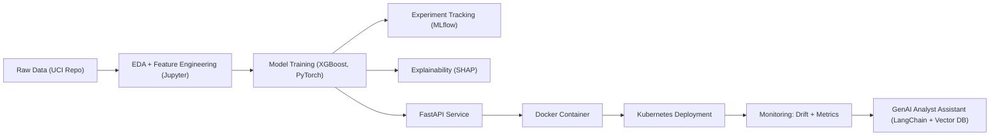

# 📊 Credit Risk Scoring & Monitoring Pipeline  

### 🎯 Project Overview  
This project builds an **end-to-end AI pipeline** for predicting **loan default risk** using the [UCI Credit Card Default Dataset](https://archive.ics.uci.edu/ml/datasets/default+of+credit+card+clients).  

It covers:  
- 📈 **EDA & Feature Engineering**  
- 🤖 **Model Training** with **XGBoost** and **PyTorch**  
- 🕵️ **Explainability** using SHAP  
- ⚙️ **MLOps Components**: MLflow (tracking), Airflow (pipelines)  
- 🌐 **API Service** with FastAPI + Docker + Kubernetes  
- 🔍 **Monitoring** for drift & performance  
- 💡 **Optional GenAI Assistant** using LangChain + Vector DB to query model insights  

---

## 📂 Dataset  
- Source: UCI Credit Card Default Dataset ([ID 350](https://archive.ics.uci.edu/ml/datasets/default+of+credit+card+clients))  
- Rows: 30,000 credit card clients  
- Columns: 23 features + 1 target (`Y_default payment next month`)  

---

## 🏗️ Architecture  



---

## ⚡ Features  

✅ **EDA & Preprocessing:** Missing values, outliers, ratios (utilization, repayment)  
✅ **Models:**  
- XGBoost baseline  
- PyTorch MLP comparison  
✅ **Evaluation:** AUC, F1, recall, calibration curves  
✅ **Explainability:** SHAP feature importance  
✅ **MLOps:**  
- MLflow experiment tracking  
- Airflow DAG for ETL + training  
- Docker + Kubernetes deployment  
✅ **Monitoring:** Drift & metric tracking  
✅ **GenAI Assistant:** Query insights with LangChain + FAISS  

---

## 📂 Repository Structure  

```bash
bank-risk-scoring/
 ├── data/                 # Dataset (or link)
 ├── notebooks/            # Jupyter notebooks (EDA, experiments)
 ├── src/                  # Source code
 │   ├── preprocessing.py
 │   ├── train.py
 │   ├── evaluate.py
 │   ├── explainability.py
 │   └── serve.py          # FastAPI app
 ├── airflow_dags/         # Airflow pipelines
 ├── mlflow_experiments/   # MLflow outputs
 ├── docker/               # Dockerfile(s)
 ├── k8s/                  # Kubernetes manifests
 ├── requirements.txt      # Python dependencies
 ├── README.md             # Documentation
 └── .gitignore
```

---

## 🚀 Installation  

### 1. Clone repo  
```bash
git clone https://github.com/username/bank-risk-scoring.git
cd bank-risk-scoring
```

### 2. Create virtual environment (Python 3.11 recommended)  
```bash
python3.11 -m venv .venv
source .venv/bin/activate
```

### 3. Install requirements  
```bash
pip install --upgrade pip
pip install -r requirements.txt
```

---

## ▶️ Usage  

### Run EDA  
```bash
jupyter notebook notebooks/eda.ipynb
```

### Train model  
```bash
python src/train.py
```

### Evaluate  
```bash
python src/evaluate.py
```

### Serve model API  
```bash
uvicorn src.serve:app --reload
```
Endpoint example:  
```bash
curl -X POST "http://127.0.0.1:8000/predict"      -H "Content-Type: application/json"      -d '{"X1_LIMIT_BAL":20000,"X5_AGE":35,"X6_PAY_0":1,"X12_BILL_AMT1":5000,"X18_PAY_AMT1":1000}'
```

---

## 🛠️ Roadmap  

- [x] Data loading via UCI repo API  
- [x] EDA (demographics, limits, bills, payments, repayment history)  
- [ ] Feature engineering (ratios, delays, utilization)  
- [ ] Baseline model (XGBoost)  
- [ ] Deep learning comparison (PyTorch MLP)  
- [ ] Explainability (SHAP)  
- [ ] FastAPI deployment  
- [ ] Docker + Kubernetes orchestration  
- [ ] MLflow + Airflow integration  
- [ ] Monitoring dashboard  
- [ ] GenAI assistant (LangChain + FAISS)  

---

## 📜 License  
MIT License  
